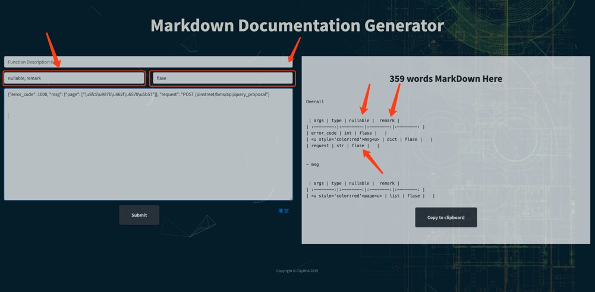

# json转Markdown工具（用于快速生成接口文档）

> ### 项目地址：https://json2md.yifeilu.cn

> 此工具可将json格式数据转换为Markdown表格数据，或输出“flask_docs”格式的接口文档，节省开发人员时间，提升效率

## 示例：


----

 **若输入一个请求json和一个响应json则可以输出完整的接口文档**

## 示例：


----

**或者可以输入API BluePrint**

## 示例：


----

## 使用说明
                           

程序接收以下类型参数：

Sample API Blueprint Format:
```http
# POST /pinstreet/promote/egg_edu/api/v1/exchange

+ Request (application/json; charset=utf-8)

    + Headers

            uid: super_YH

    + Body

            {
                "ea_id": "64",
                "exchange_info": "9"
            }

+ Response 400 (application/json)

        {"error_code": 1000,
        "msg": {"exchange_info": ["This field is required."]},
        "request": "POST /pinstreet/promote/egg_edu/api/v1/exchange"}
```

Sample Request/Response Format:
```json
{
    "proposal_list" :[{"id":"146","approve":"1"}]
}
{
    "error_code": 0,
    "msg": "success",
    "request": "POST /pinstreet/bms/api/update_proposal_approve"
}
```

Sample json Format:
```json
{
    "proposal_list" :[{"id":"146","approve":"1"}]
}
```

**并且接收自定义参数**




